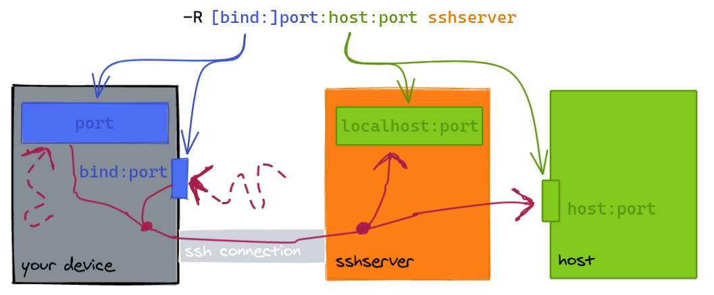
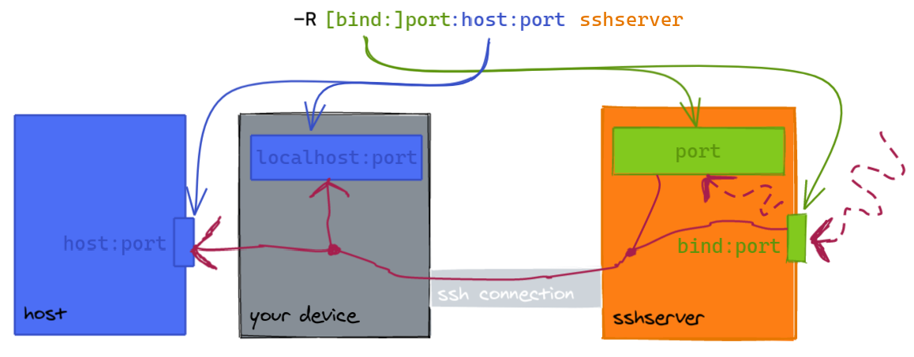

# SSH

Escape sequences

* `<Enter> ~.` - terminate connection (and any multiplexed sessions)
* `<Enter> ~C` - open command console
* `<Enter> ~?` - help message

## Managing Keys

[The full reference](https://wiki.archlinux.org/index.php/SSH_keys "Arch Linux Wiki") \(Arch Wiki\).

Common commands:

```
# Create new secure key with comment (User@Device#Realm)
ssh-keygen -t ed25519 -C Qasim@PC#QasimK

# Change passphrase of existing key
ssh-keygen -f ~/.ssh/id_ed25519 -p

# Add your credentials to remote server to allow you to login
ssh-copy-id -i ~/.ssh/id_ed25519.pub <host>
```

`ssh-copy-id` adds your SSH key to the remote user's `authorized_keys` file.

## Port Forwarding (TCP-only)

Requests to a local port are sent to a remote host/port:

* The default `bind` address is `localhost`.
* `host` can be `localhost` which means `sshserver` or a remote host.



Requests to a remote port are sent to a "local" port:

* The default `bind` address is `localhost` on `sshserver`.
  (Changing this requires `GatewayPorts` in `sshd_config`.)
* The "local" port can be on your device or another `host`.



To cancel port forwarding:

1. In a multiplexed session, run `ssh -O cancel <port forward command> <host>`.
2. Otherwise enter the control console and type `-KL <port forward command>`
   (or `-KR` or `-KD`).

## Autossh

[autossh](https://github.com/halida/autossh) can restart an SSH command.

Recommendation: use `-M0` with `ServerAliveInterval` and `ServerAliveCountMax`.

## SSHD

Test config with `sudo sshd -T` before restarting the daemon.

The following settings are ordered starting from the most significant, least invasive and easiest to setup:

* Prevent root login
* Use SSH keys only
* Use a less common port, e.g. 24
* Only allow particular groups/users to login \(such as `wheel`, the administrative group\)

```
PermitRootLogin no
PasswordAuthentication no
Port 23
AllowGroups wheel
AllowUsers qasim
```

* Rate-limit attempts: `sudo ufw limit OpenSSH`  \(NB: check auto correct port?\)
* Use `ssh-geoip` \(blacklist IPs rather than whitelist to prevent lockout\) \(not tested; IPv6?\)
* Use an [SSH bastion](https://blog.scottlowe.org/2016/09/13/ssh-bastion-host-follow-up/).
* Use fail2ban \(not needed with SSH keys; lockout risk\)
* [Require 2FA](http://www.justgohome.co.uk/blog/2013/07/better-two-factor-ssh-authentication-on-ubuntu.html): `libpam-google-authenticator` \(longer setup; not tested; has backup codes\)

## Mosh

* Mosh uses SSH for initial authentication.
* Requires UDP ports 60000–61000 to be open \(you can get away with 60000-60010\).


