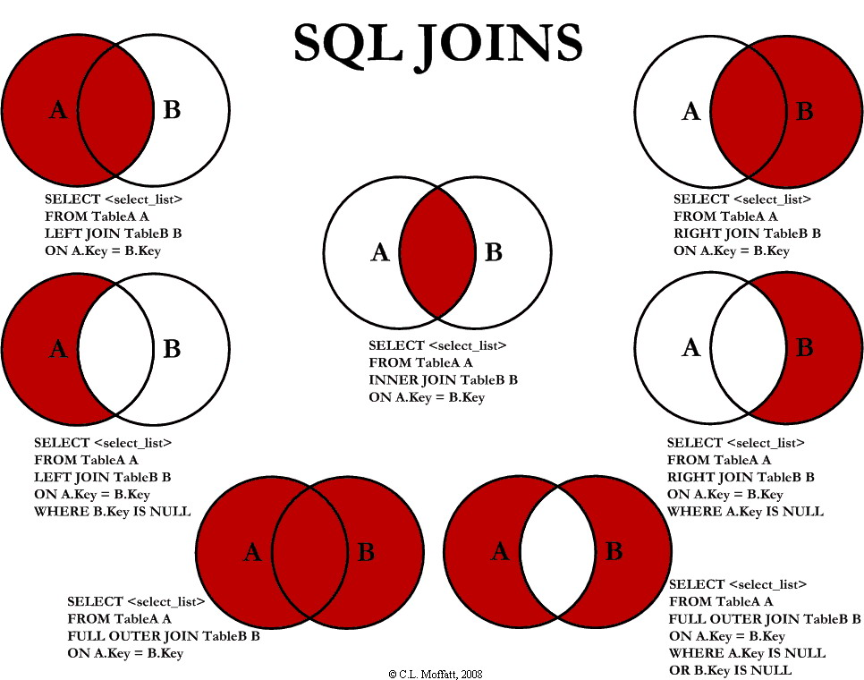

**Joins start off as a cross-product**, and predicates \("ON"\) filter the rows down.

* **LEFT OUTER JOIN** - always return all rows for A, with anything that happens to match in B \(ie. B could be null\).
* **RIGHT OUTER JOIN**s are fairly useless - just do a left join for intuitiveness \(possible exception for 3+ tables?\).
* **FULL OUTER JOIN** - either side could be null.
* **INNER JOIN** - return only rows with matching records on both sides.

## Lateral Joins

A lateral join is like a for-each loop. It can join multiple rows for each original row.

Contrast this with a correlated subquery which can only return one row.

Each lateral join subquery in the `FROM` clause can reference columns from preceding FROM subqueries. Without the lateral, each subquery is evaluated independently.
